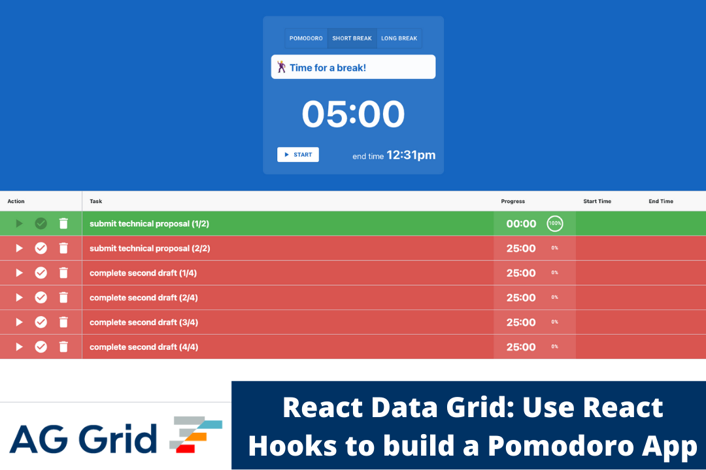

# React Data Grid: Use React Hooks to build a Pomodoro App

This repository contains the source code for the application, for a detailed explanation please see the [accompanying blog post](https://blog.ag-grid.com/react-data-grid-use-hooks-to-build-a-pomodoro-app/) which explains the implementation.

To see the application running, open [https://shuheb.github.io/ag-grid-pomodoro/](https://shuheb.github.io/ag-grid-pomodoro/) to view it in the browser.

## Installation

In the project directory, install the dependencies:
### `npm install`

To run the app in development mode:
### `npm run start`

Open [http://localhost:3000](http://localhost:3000) to view it in the browser.